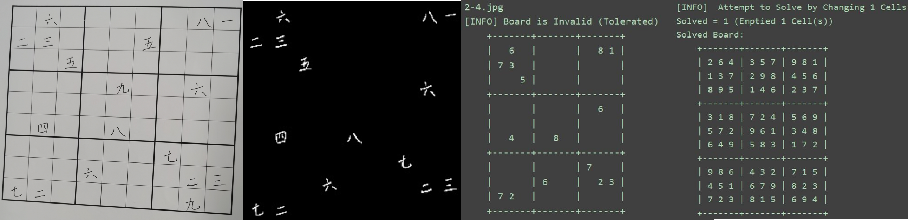

# Sudoku Project Report
EI339 Artificial Intelligence, 2020 Fall, SJTU
**by Prof. Jun Z.**
<!-- <br> -->


<br>


<!-- MarkdownTOC -->

- [Sudoku Project Report](#sudoku-project-report)
  - [Description](#description)
  - [Highlights](#highlights)
  - [Environment](#environment)
  - [Project File Tree](#project-file-tree)
  - [Task 1 - OpenCV Sudoku Solver and OCR](#task-1---opencv-sudoku-solver-and-ocr)
    - [Image Preprocessing](#image-preprocessing)
      - [Multi-Image View](#multi-image-view)
      - [Board Detection](#board-detection)
      - [Digits Extraction](#digits-extraction)
    - [Neural Network - `SudokuNet`](#neural-network---sudokunet)
    - [Execution - OpenCV Sudoku Solver](#execution---opencv-sudoku-solver)
      - [Training](#training)
      - [Puzzle Solving](#puzzle-solving)
  - [Task 2 - Sudoku Solver](#task-2---sudoku-solver)
    - [Sudoku Board](#sudoku-board)
    - [Sudoku Solver](#sudoku-solver)
      - [Error Tolerable Solver](#error-tolerable-solver)
    - [Execution - Sudoku Board and Solver](#execution---sudoku-board-and-solver)
  - [Task 3 - LeNet-5](#task-3---lenet-5)
    - [Data Loader](#data-loader)
    - [Execution - Hyper-Parameters of Training](#execution---hyper-parameters-of-training)
    - [Execution - Structure of LeNet-5 Implementation](#execution---structure-of-lenet-5-implementation)
  - [Execution - Classifiers + Solver](#execution---classifiers--solver)
    - [SudokuNet + Solver](#sudokunet--solver)
      - [Single Test Image](#single-test-image)
      - [Multiple Test Images](#multiple-test-images)
    - [LeNet-5 + Solver](#lenet-5--solver)
      - [Single Test Image](#single-test-image-1)
      - [Multiple Test Images](#multiple-test-images-1)
  - [Final Execution - EI339 Test Sudoku Boards](#final-execution---ei339-test-sudoku-boards)
  - [Summary](#summary)
  - [Appendix](#appendix)
    - [Multi-Image View Implementation](#multi-image-view-implementation)
    - [Sudoku Board Implementation](#sudoku-board-implementation)
    - [Sudoku Solver Implementation](#sudoku-solver-implementation)

<!-- /MarkdownTOC -->


<br>

<div style="page-break-after: always;"></div>


<a id="description"></a>
## Description

1. Understand the provided codes of `OpenCV Sudoku Solver and OCR` approach.
2. Cooperate with fellow classmates to construct the `EI339-CN` dataset of handwritten Chinese numbers `一, 二,..., 九, 十`.
3. Implement LeNet-5 and train on `MNIST + EI339-CN`.
4. Implement a CSP solver for the Sudoku problem.
4. Test the trained model and the solver upon given test images.

<br>

<a id="highlights"></a>
## Highlights

0. Modern project management: [Github](https://github.com/marridG/2020-EI339) (Accessible after DDL 2021/01/07 00:00 UTC+8). *For better report or codes layouts, the online version might be more preferable*. Codes insight: 116 commits 7,201 ++ 3,458 --.
1. Fully-annotated codes: both in function prototypes and between the lines.
2. Carefully designed and wrapped functionalities: divide the board-extraction, Sudoku-board-formation, problem-solving processes into different packages and provide high-level APIs.
3. Extensive experiment upon **(1)** influence of the selection of train and test datasets; *(2)** SudokuNet VS LeNet-5; **(3)** LeNet-5 activations (with analysis), training hyper-parameters.
4. Error-tolerable CSP Sudoku solver.
5. Construct real-world Sudoku problems set based on the published book `《全民数独》` and conduct tests upon the images captured from 5 angles: bird-view, left, upper, right and lower.
6. Analysis and solid intermediate results.
7. Some other implemented useful functionalities.

<br>


<a id="environment"></a>
## Environment
+ OS: `Windows 8.1 Pro`  
+ Python Interpreter: `Python 3.7.6 MSC v.1916 64bit on win32`  
+ IDE: `Pycharm 2020.1.1 (Professional Edition), Build #PY01-201.7223.92`  

<br>


<div style="page-break-after: always;"></div>


<a id="project-file-tree"></a>
## Project File Tree
```
~
│  .gitignore
│  LICENSE
│  README.md
│  
├─digit_classifiers                     // codes for digit classifiers
│     networks_models.py                // network utilities (e.g. training)
│     networks_structures.py            // network structures (LeNet-5 here)
│     __init__.py
│          
├─extract_sudoku                        // [wrapper] step of extract Sudoku image
│     board_img_arr.py                  // image == extract ==> Sudoku board object
│     LeNet5__predict.py                // API of LeNet-5 prediction
│     LeNet5__train.py                  // API of LeNet-5 training
│     opencv__predict.py                // API of SudokuNet prediction
│     opencv__train.py                  // API of SudokuNet prediction
│     __init__.py
│          
│─solve_sudoku
│      sudoku_board.py
│      sudoku_solver.py
│      __init__.py
│
│
├─examples                              // example codes
│      extract_board.py                 // example codes to extract Sudoku boards
│      solve-sudoku.py                  // example codes to solve Sudoku problems
│      sudoku_puzzle.jpg                // example image
│
├─run                                   // final codes to execute
│  │  final_imgs.py                     // solve the given 5+5 final images
│  │  LeNet5_params.py                  // hyper-parameters test codes
│  │  LeNet5_structure.py               // structure test codes
│  │  solve_by_LeNet5.py                // LeNet-5 100-image test codes
│  │  solve_by_opencv.py                // SudokuNet 100-image test codes
│  │  
│  ├─final_out                          // results of the given 5+5 final images
│  ├─num_changed_plot                   // results of 100-image test
│  ├─params_plot                        // plots of hyper-parameters tests
│  ├─params_report                      // .json reports of hyper-parameters tests
│  ├─structure_plot                     // plots of network structure tests
│  └─structure_report                   // .json reports of structure tests
│               
│
├─data
│  │  load_local_dataset.py             // data loader codes
│  │  
│  ├─EI339-CN dataset sjtu              // EI339 dataset folder
│  │  ├─1, 2, ..., 10                   // raw data of EI339
│  │  ├─mapping                         // intermediate folder: filenames mapping of EI339
│  │  └─processed                       // data file (.pt) of EI339
│  │          
│  ├─MNIST                              // data file of MNIST
│  └─MNIST+EI339                        // combined data file (.pt) of MNIST+EI339
│          
├─imgs                                  // test images folder & loader
│  │  load_imgs.py                      // image loader
│  │  overview.py                       // generate an overview of 100-image test images
│  │  sudoku_puzzle.jpg                 // test image
│  │  __init__.py
│  │  
│  ├─JilinUnivPr                        // images captured from 《全民数独》, 吉林大学出版社
│  │  └─imgs                            // 100 images of 100-image tests
│  │          
│  └─test1                              // final 5+5 test Sudoku problems images 
│          
├─models                                // trained models
│      
├─opencv_sudoku_solver                  // given OpenCV approach proposed online
│  │  solve_sudoku_puzzle.py            // solved codes
│  │  sudoku_puzzle.jpg                 // test image
│  │  train_digit_classifier.py         // train codes
│  │  __init__.py
│  │  
│  ├─output                             // output models
│  │      
│  └─pyimagesearch                      // SudokuNet & captured board extractor
│     │  __init__.py
│     │  
│     ├─models                          // SudokuNet structure
│     │     sudokunet.py
│     │     __init__.py
│     │          
│     └─sudoku                          // captured board extractor
│           multi_img_view.py           // added functionality: combine & show multiple images together
│           puzzle.py                   // board extractor: find puzzle & extract digit
│           __init__.py
│          
└─report                                // report files
```

<div style="page-break-after: always;"></div>


<a id="task-1---opencv-sudoku-solver-and-ocr"></a>
## Task 1 - OpenCV Sudoku Solver and OCR
This part is mainly based on the provided codes ([source](https://www.pyimagesearch.com/2020/08/10/opencv-sudoku-solver-and-ocr/)), the explanations of which is almost fully included in the post. For simplicity, we do not repeat details mentioned already.  
As a matter of fact, the most helpful part may be the magic-like OpenCV operations on the original image. We take advantage of its board-detection and digit-image-extraction. As for the digit recognization, we will reconstruct another network later.


<br>

<a id="image-preprocessing"></a>
### Image Preprocessing
Python OpenCV magics.

<a id="multi-image-view"></a>
#### Multi-Image View
To view and compare images more conveniently in one figure, I implement `multi_img_view(images, row_cnt, col_cnt, title, fig_size, close_all)`, the full codes of which is given in [Appendix: Multi-Image View Implementation](#multi-image-view-implementation)


<a id="board-detection"></a>
#### Board Detection
This functionality is implemented in file 
`/opencv-sudoku-solver/pyimagesearch/sudoku/puzzle.py`, as,
```Python
find_puzzle(image: np.ndarray, debug: bool = False) -> (np.ndarray, np.ndarray)
```
By changing popping out debug images to adding to multi-image-view group, for the sample image, we may get the intermediate images, as,

<div style="text-align: center;">
    
</div>


<br>

<a id="digits-extraction"></a>
#### Digits Extraction
This functionality is implemented in file 
`/opencv-sudoku-solver/pyimagesearch/sudoku/puzzle.py`, as,
```Python
extract_digit(cell: np.ndarray, debug: bool = False)
```
By changing popping out debug images to adding to multi-image-view group, for the sample image, we may get the intermediate images, in cases where there is/is not a digit, as,

<div style="text-align: center;">
    
</div>

<br>


<a id="neural-network---sudokunet"></a>
### Neural Network - `SudokuNet`
The architecture of `SudokuNet`, implemented in `/opencv-sudoku-solver/pyimagesearch/models/sudokunet.py`, is depicted as follows, (generated using [tools](http://alexlenail.me/NN-SVG/AlexNet.html))

<div style="text-align: center;">
    
</div>


<br>


<a id="execution---opencv-sudoku-solver"></a>
### Execution - OpenCV Sudoku Solver
<a id="training"></a>
#### Training
By executing `python train_digit_classifier.py --model output/digit_classifier_new.h5`, we get the following outputs,

<div style="text-align: center;">
    
</div>


<a id="puzzle-solving"></a>
#### Puzzle Solving
By executing `python solve_sudoku_puzzle.py --model output/digit_classifier_new.h5 --image sudoku_puzzle.jpg`, we use the model trained above to solve the sample sudoku problem. If fortunate enough, we may get accurate outputs, as shown (combined) as follows,

<div style="text-align: center;">
    
</div>


<br>

<div style="page-break-after: always;"></div>


<a id="task-2---sudoku-solver"></a>
## Task 2 - Sudoku Solver
Intuitively, we may divide the task into two parts,

+ Implement a class of sudoku board, which supports actions directly related to the board such as
    * store the board
    * check the validation of the board
    * print the numbers of the board
    * get possible numbers of each cell
+ Implement a solver based on the board class

Both parts are introduced below.


<br>


<a id="sudoku-board"></a>
### Sudoku Board
The basic structure of the board class, implemented in `/solve-sudoku/sudoku_board.py`, is given in [Appendix: Sudoku Board Implementation](#sudoku-board-implementation)


<br>


<a id="sudoku-solver"></a>
### Sudoku Solver
The basic structure of the solver class, implemented in `/solve-sudoku/sudoku_solver.py`, is given in [Appendix: Sudoku Solver Implementation](#sudoku-solver-implementation)  
The solver itself is straightforward to implement, as a CSP problem. We may simply use the recursive backtracking approach as follows:

+ Iterate through all unfilled cells (for simplicity, flatten the board into an line vector)
+ For each iterated cell, try all its possible values (through the functionality supported by the `SudokuBoard` class).
    * If such values do not exist and the board is not all filled, then something goes wrong before.
    * If such values do not exist and the board is all filled, then a solution is acquired.

<a id="error-tolerable-solver"></a>
#### Error Tolerable Solver
Frankly speaking, if the board is incorrect, i.e., the predicted numbers given by the neural network is wrong, the problem itself is not related to the original one any longer. Thus, error correction is unnecessary at all.  
However, due to the requirements, here, we propose a simple but effective approach for error-tolerable sudoku boards.  
The approach is somehow straightforward, as,

+ The error correction process is entered in two cases,
    * The to-solve board itself is invalid.
    * No solutions are found for the initially seemingly valid board, i.e., actually invalid all after.
+ The error correction process is committed as follows,
    * Begin at the initial board.
    * Extract all indices of nonempty cells, i.e., indices of cells assigned with possibly wrong numbers.
    * Iterate from 1 to the number of such cells. The iteration index illustrates the number of nonempty cells to change.
    * In the current iteration upon the number of nonempty cells to change, 
        - Generate all the combinations.
            + e.g. Suppose cells indexed `[0, 1, 2, 3]` are nonempty and that we have iterated to index 2, then the combinations are `[(0, 1), (0, 2), (0, 3), (1, 2), (1, 3), (2, 3), ]`
        - For each combination, simply empty all the cells in the combination, since,
            + Intuitively, we ought to change the values of the cells in the combination to one of the possible values of them
            + The intuitive attempts are exactly the same as the backtracking search of a unfilled cell.
        - If a solution is found for a certain combination, the error-tolerable solution is found.
    * Notice that, a solution can always be found, since, in the worst case, we may empty all nonempty cells (resulting in "solving" a completely empty board).


<br>

<a id="execution---sudoku-board-and-solver"></a>
### Execution - Sudoku Board and Solver
As depicted in the following figure, given an invalid board as in the left, we may change one cell to get a solution as in the right.  

<div style="text-align: center;">
    
</div>


<br>

<div style="page-break-after: always;"></div>


<a id="task-3---lenet-5"></a>
## Task 3 - LeNet-5
Based on `LeCun, Yann, Léon Bottou, Yoshua Bengio, and Patrick Haffner. "Gradient-based learning applied to document recognition." Proceedings of the IEEE 86, no. 11 (1998): 2278-2324`, we may implement the proposed LeNet-5 structure, as illustrated in the figure below,

<div style="text-align: center;">
    
</div>

In modern frameworks, some tricks of `LeNet-5` (like layer $C3$, originally proposed due to the computation limits that time) are unnecessary at all. Thus, we may further simplify the network connections and add nonlinear activations for better performance.

Here the **output is of shape 20**, where labels `0-9` correspond to algebraic numbers` 0-9` and labels `10-19` to Chinese numbers `十,一,...,九`.

To get familiar with `PyTorch`, LeNet-5 is implemented in the framework of `PyTorch` from scratch, instead of in `TensorFlow` based on the [Network `SudokuNet` of the post](#neural-network---sudokunet).


<br>


<a id="data-loader"></a>
### Data Loader
To feed the training data and prepare the test data, i.e., while combining datasets `MNIST` and `EI339`, where `EI339` is the dataset of handwritten Chinese numbers (1-10) created by all students in the course, notice that,

* Even if instructed, the idea of **dividing** raw `EI339` dataset images only according to student-ID is **far from reasonable**. 
    - The division is done as,
        + All the students (denote as set $S$) are divided into two non-intersect subsets, say $A, B \subset S$, $A+B=S$.
        + The training set is constructed only by all the images from students in subset $A$.
        + The test set is constructed only by all the images from students in subset $B$.
    - However, intuitively, there are apparent problems. 
        + Suppose student $b \in B$. Thus, images from $b$ are all categorized as test set.
        + As a result, no patterns of B's handwriting can be learned in the training, which makes the prediction almost meaningless.
        + After all, we are conducting the traditional task of number classifications, instead of real-time predictions, where future input samples cannot be estimated.
* For better performance, **several shuffles** are done, as,
    - shuffle the raw images of `EI339` before constructing the dataset file
    - shuffle the concatenated data from `MNIST` and `EI339` before constructing the combined dataset file
    - At the same time, the load of dataset files are remained to be flagged with shuffle enabled.


<br>


<a id="execution---hyper-parameters-of-training"></a>
### Execution - Hyper-Parameters of Training
In this section, we use `ReLU` activation function.  
<br>
**Firstly**, how the LeNet-5 model learns the features of the input training data.

<div style="text-align: center;">
    
</div>

As is shown in the above figure (invisible elements are of values exactly 0),

+ The overall learning of any of `MNIST`, `EI339` and `MNIST+EI339` is satisfactory enough.
+ As expected, the features of digits (represented by `MNIST`) and Chinese numbers (represented by `EI339`) are quite different, resulting in extremely low test accuracies, as 0.


<br>

**Secondly**, the impact of `BatchSize` and `Epoch` values on the test accuracies.  

<div style="text-align: center;">
    
    <!-- 
     -->
</div>

As is shown in the figure above *(left: `BatchSize`; right: `Epoch`)*, there are,

+ As expected, the larger the `BatchSize`, the lower the overall test accuracies are. However, quite intuitively, the smaller the `BatchSize`, the more time the training consumes. Thus, an intermediate value should be chosen. Commonly, values of about 30 are selected for the image classification tasks.
+ As expected, the larger the `Epoch`, the higher the overall test accuracies are. Similarly, large `Epoch` values results in longer training time. Proper values depend on whether a fine-grained model is required.  


<br>


**Thirdly**, the impact of `LearningRate` values on the train and test results.  

<div style="text-align: center;">
    
    <!-- 
     -->
</div>

As is shown in the figure above *(left: train loss; right: train accuracy tested upon training set after each training epoch)*, we have the following observations, (from which the major training babysitting is done)

+ As expected, proper `LearningRate` values (e.g. `5e-3, 1e-3`, etc.) result in a decreasing train loss.
+ `LearningRate` values (`1e-1, 5e-2`) are too large, resulting in bad loss convergence (in an increasing trend) and accuracy (in a decreasing trend).
+ Among the remaining `LearningRate` values (`1e-2, 5e-3, 1e-3, 5e-4, 1e-4`), the loss and accuracy curves are all not too steep or too shallow. Thus, with the execution time being taken into consideration, we may select any of them. Notice that,
    * A steep curve indicate a proper but still too large `LearningRate`.
    * A shallow curve indicate a proper but still too small `LearningRate`.


<br>


<div style="text-align: center;">
    
    <!-- 
     -->
</div>

**Meanwhile**, we may decide `LearningRate` further based on the trends shown in the above figure *(left: train loss; right: train accuracy tested upon training set after each training epoch)*, as, 

+ (From left) too large `LearningRate` values result in low test accuracies.
+ (From left) too small `LearningRate` values may lead to too slow learning updates to acquire most features in the given epochs.
+ (From right) the trained model demonstrates big gap between validation on training and test dataset, indicating over-fitting, which is quite comprehensive and supports the [previous argument about the bad data division](#data-loader)


<br>


<a id="execution---structure-of-lenet-5-implementation"></a>
### Execution - Structure of LeNet-5 Implementation
From the discussion of hyper-parameters mentioned above, the experiment here is based on the setting `BatchSize=32, LearningRate=1e-3, Epoch=10, Train&Test=MNIST+EI339`.  
For simplicity, we only test several activation functions used after each convolution layer, as,

+ `ReLU`: $ReLU(x) = (x)^+ = max(0, x)$
+ `Tanh`: $Tanh(x) = tanh(x) = \frac{e^x - e^{-x}}{e^x + e^{-x}}$
+ `Sigmoid`: $Sigmoid(x) = \frac{1}{1 + e^{-x}}$
+ `Leaky ReLU`: $LeakyReLU(x) = \max(0,x) + 0.01*\min(0,x) = \max(0.01x, x)$
+ `ELU`: $ELU(x) = \max(0,x) + \min(0, 1*(e^x-1))$

The training accuracies are illustrated in the below figure,

<div style="text-align: center;">
    
</div>

From which, we have the following observations and attributions,

1. `Sigmoid` performs the worst.  
    As a historically popular activation function due to the interpretation of neuron "firing rate", it suffers from two major problems here,

    + For "large"/"small" input values, the function saturates, which leads to almost zero gradients. As a result, the updates in the training here cannot be done effectively.
    + The outputs are not zero-centered, which destroys the pre-guaranteed property.
    
2. `Tanh` performs good, but not satisfactory enough.  
    It is better than `Sigmoid` here due to the zero-centered property (but still possibly saturated), which further supports our arguments.

3. `ReLU`, `Leaky ReLU` and `ELU` all perform well. Among them, `ELU` takes the lead and `ReLU` falls in the last.

    + **`ReLU` outperforms `Tanh` and `Sigmoid`** mainly since saturation is avoided, though suffering the zero-centered problem.
    + **`Leaky ReLU` outperforms `ReLU`** since the former takes advantage of all strengths of the latter and avoids dead cases where `ReLU` is initialized out of data and never updates.
    + For a similar reason, **`ELU` outperforms `ReLU`**.
    + **`ELU` outperforms `Leaky ReLU`** since the negative part of the former is much smoother, leading to better results here, at the cost of computation time.


Meanwhile, the test accuracies are listed in the below table,
    
| ReLU | Tanh | Sigmoid | Leaky ReLU | ELU |
| :-----: | :----: | :----: | :----: | :----: |
| 97.45 | 96.20 | 9.43 | 97.31 | 97.26 |

However, the trend of the test accuracies are not in accordance with that of the training, in that `ReLU > Leaky ReLU > ELU > Tanh >> Sigmoid` instead of `ELU > Leaky ReLU > ReLU > Tanh >> Sigmoid`, mainly possibly because of the bad division of train and test datasets.


<br>
<div style="page-break-after: always;"></div>


<a id="execution---classifiers--solver"></a>
## Execution - Classifiers + Solver

Here we test how either of the two classifiers works together with the solver by,

+ Run on the same test image used in the post of the OpenCV approach.
+ Run on images of Sudoku problems captured by the author, with details given as,
    * purpose: analyze the overall effectiveness of using networks to extract sudoku boards (thus, and for economical concerns, for each image, at most 5 cells are allowed to be changed to reach a solution)
    * 100 images altogether
        - from 20 boards
        - each board from five angles of views: bird-view, lower, left, upper and right
    * all problems from the book `《全民数独 2 初级篇》 马荣鸿 吉林大学出版社`
    * images preview illustrated in the following figure,

<div style="text-align: center;">
    
</div>


<br>


<a id="sudokunet--solver"></a>
### SudokuNet + Solver
<a id="single-test-image"></a>
#### Single Test Image
By connecting the SudokuNet model (trained with `LearningRateR=1e-3, Epoch=10, BatchSize=32`) with the solver, in most cases, we may get the following somehow inaccurate test results, *(*left*: test Sudoku image; *middle & right*: results)*

<div style="text-align: center;">  
    
</div>

From which, 

+ 4 cells are classified wrongly.
+ At least 4 cells should be emptied to get a solution.


<a id="multiple-test-images"></a>
#### Multiple Test Images
By connecting the SudokuNet model with the solver, we may get the following test results upon the 100 images describe above,  

<div style="text-align: center;">
    
</div>

From which, 

+ Unsolved ratios are high, indicating that most board images are facing the problem of incorrect digit recognition. Since the number of filled cells is big, more errors appear and less possible the board can be solved within 5 changes of cells.
+ Angles of lower (denser distribution) and right (higher probability of solution existence) are more preferable (somehow meaningless though).
+ The captured image of Sudoku board should be of the one with less filled numbers for better performance.


<br>

<a id="lenet-5--solver"></a>
### LeNet-5 + Solver
<a id="single-test-image-1"></a>
#### Single Test Image
By connecting the LeNet-5 model (using `ReLU`activations, trained with `BatchSize=32, LearningRate=1e-3, Epoch=10`) with the solver, we may get the following test results, *(*left*: test Sudoku image; *middle & right*: results)*  

<div style="text-align: center;">
    
</div>

From which, 

+ 4 cells are classified wrongly, among which not all are the same as those by SudokuNet.
+ At least 4 cells should be emptied to get a solution.


<a id="multiple-test-images-1"></a>
#### Multiple Test Images
By connecting the SudokuNet model with the solver, we may get the following test results upon the 100 images describe above,  

<div style="text-align: center;">
    
</div>

From which, 

+ Unsolved ratios are high, indicating that most board images are facing the problem of incorrect digit recognition. Since the number of filled cells is big, more errors appear and less possible the board can be solved within 5 changes of cells.
+ Angle of right (denser distribution and higher probability of solution existence) is the most preferable (somehow meaningless though).
+ The captured image of Sudoku board should be of the one with less filled numbers for better performance.


<!-- <br> -->

<div style="page-break-after: always;"></div>


<a id="final-execution---ei339-test-sudoku-boards"></a>
## Final Execution - EI339 Test Sudoku Boards
Although using models more advanced than LeNet-5 is allowed in this task, for simplicity, we stick on it and do not introduce other networks, since, 

+ The change of network structures includes almost just the same procedures as those done for LeNet-5, suggesting duplicate time-consuming work.
+ Moreover, as stated by instructors, the project itself does not require high model accuracy.

With regard to the test images provided by EI339 instructors, we have the following test results, (using LeNet-5 structure of `ReLU` activation trained with `BatchSize=32, LearningRate=1e-3, Epoch=10`)

Notice that, here, 

+ Since the writings are too light, they must be strengthened (e.g. using `cv2.dilate()`).
+ In the original digit extraction, a mask upon the largest contour is used. However, the trajectories of the Chinese numbers characters are not totally continuous. Thus, for the Chinese numbers, such functionality must be disabled.

The test results of the ten Sudoku images are, (*left-most*: manually cropped Sudoku image; *left*: extracted digits, *right*: predicted board, *right-most*: solve results)
<div style="text-align: center;">
    
    
    
    
    
    
    
    
    
    
</div>

From which, we may come to the following observations and attributions,

+ The recognization accuracy of algebraic numbers is rather low, resulting in the fact that most problems cannot be solved within 5 changes.  
    However, such phenomenon is far from expectation. The training set of algebraic is much larger and of higher quality than that of EI339, which should guarantees better performance.  
    A possible cause might lie in that the characteristics of Chinese numbers are more distinct and obvious. Thus, some of the algebraic numbers are trained more related to those of the Chinese ones.
+ In the recognization of Chinese numbers, mis-interpreted errors at the highest frequency are mainly `三 -> 2(二), 二 -> 3(三), 六 -> 8(八)`, which are quite comprehensive considering the structures of these writings.
+ As a result, the more difficult the problem is the more possible that it can be solved, which is in accordance with the difficulty growth from 1-1 to 1-5 (or 2-1 to 2-5).


<br><br>

<a id="summary"></a>
## Summary
Generally speaking, the project provides a hands-on introduction and insight of the CNN classifiers and CSP solver. At the same time, Python coding and project management is practiced.
To sum up, time-consuming though for me, the project contents are solid and helpful.


<br>

<div style="page-break-after: always;"></div>


<a id="appendix"></a>
## Appendix

<a id="multi-image-view-implementation"></a>
### Multi-Image View Implementation
[Back to Section Multi-Image View](#multi-image-view)
```Python
import typing
import matplotlib
from matplotlib import figure
from matplotlib import pyplot as plt

def multi_img_view(images: list, subtitles: list,
                   row_cnt: int, col_cnt: int,
                   title: str = "MULTI-IMG VIEW",
                   fig_size: typing.Tuple[int, int] = None,
                   close_all: bool = True) \
        -> matplotlib.figure.Figure:
    """
    Combine and Show Several Images Together
    :param images:          list of images
    :param subtitles:       list of the subtitles of the images
    :param row_cnt:         number of rows
    :param col_cnt:         number of columns
    :param title:           title of the combine image
    :param fig_size:        size of the figure, (width, height)
    :param close_all:       whether to close all figures during initialization
    :return:                plt, fig
    """
    if close_all:
        plt.close("all")
    if len(images) != len(subtitles):
        raise RuntimeError("[Error] Images Count and Subtitles Count Mismatch:"
                           "Images = %d, Subtitles = %d" % (len(images), len(subtitles)))
    if len(images) > row_cnt * col_cnt:
        raise RuntimeError("[Error] Images Count Overflow:"
                           "Got Max row*col=%d*%d, Assigned %d" % (row_cnt, col_cnt, len(images)))

    if fig_size is not None:
        fig, _ax = plt.subplots(nrows=row_cnt, ncols=col_cnt, figsize=fig_size)
    else:
        fig, _ax = plt.subplots(nrows=row_cnt, ncols=col_cnt)
    ax = _ax.flatten()

    # Subplot Styles: remove spines, x/y-ticks
    for _subplot_ax in ax:
        _subplot_ax.spines['top'].set_visible(False)
        _subplot_ax.spines['right'].set_visible(False)
        _subplot_ax.spines['bottom'].set_visible(False)
        _subplot_ax.spines['left'].set_visible(False)
        _subplot_ax.set_xticks([])
        _subplot_ax.set_yticks([])

    # Show Images & Subtitles
    for _img_idx, (_img, _img_title) in enumerate(zip(images, subtitles)):
        ax[_img_idx].imshow(_img)
        ax[_img_idx].set_title(_img_title)
        ax[_img_idx].set_xticks([])
        ax[_img_idx].set_yticks([])

    fig.suptitle(title)
    # fig.tight_layout()

    return fig
```


<br>

<a id="sudoku-board-implementation"></a>
### Sudoku Board Implementation
[Back to Section Sudoku Board](#sudoku-board)
```Python
class SudokuBoard:
    def __init__(self, board: np.ndarray,
                 invalid_tolerable: bool = False, show_info: bool = True):
        """
        :param board:           Input numbers of the board, of shape (BOARD_SIZE,BOARD_SIZE)
        :param invalid_tolerable: Flag, whether to tolerate invalid input board
        :param show_info:       Flag, wehther to show hint info
        """
        pass

    def __check_row__is_valid_n_used_nums__(self, row_idx: int) \
            -> (bool, np.ndarray):
        """
        1. Check whether a specific row is valid: no duplicates in 1~MAX_NUM
        2. Return the used numbers
        :param row_idx:         Index of the to-be-checked row
                                    (starting from 0, ending at row_cnt-1)
        :return:                1. True if valid, False if invalid;
                                2. Used numbers in the row
        """
        pass

    def __check_col__is_valid_n_used_nums__(self, col_idx: int) \
            -> (bool, np.ndarray):
        """
        1. Check whether a specific column is valid: no duplicates in 1~MAX_NUM
        2. Return the used numbers
        :param col_idx:         Index of the to-be-checked column
                                    (starting from 0, ending at col_cnt-1)
        :return:                1. True if valid, False if invalid;
                                2. Used numbers in the column
        """
        pass

    def __check_box__is_valid_n_used_nums__(self, box_idx_row: int, box_idx_col: int) \
            -> (bool, np.ndarray):
        """
        1. Check whether a specific box is valid: no duplicates in 1~MAX_NUM
        2. Return the used numbers
        Notice:
            1. boxes start from [0, 0] to [self.BOARD_SIZE, self.BOARD_SIZE]
            2. box indices start from 0, end at self.BOARD_SIZE / self.BOX_SIZE,
        :param box_idx_row:     Index of the to-be-checked box in the row
        :param box_idx_col:     Index of the to-be-checked box in the column
        :return:                True if valid, False if invalid
        """
        pass

    def __idx_row_col_2_box__(self, row_idx: int, col_idx: int) -> (int, int):
        """
        Map indices by (row, col) to the index of the corresponding box of the cell
        :param row_idx:         Index of the cell in the row
        :param col_idx:         Index of the cell in the column
        :return:                Indices of the box, by (row, col)
        """
        pass

    def __check_box_row_col__is_valid_n_used_nums__(self, row_idx: int, col_idx: int) \
            -> (bool, np.ndarray):
        """
        [WRAPPER] "__idx_row_col_2_box__()" and "__check_box__is_valid_n_used_nums__()"
        1. Check whether a specific box is valid: no duplicates in 1~MAX_NUM
        2. Return the used numbers
        Notice:
            1. boxes start from [0, 0] to [self.BOARD_SIZE, self.BOARD_SIZE]
            2. box indices start from 0, end at self.BOARD_SIZE / self.BOX_SIZE,
        :param row_idx:         Index of the to-be-checked cell in the row
        :param col_idx:         Index of the to-be-checked cell in the column
        :return:                True if valid, False if invalid
        """
        pass

    def __validate_input_idx_is_valid(self, row_idx: int, col_idx: int) -> None:
        """
        Check whether a input index (row, col) is valid
        :param row_idx:         Input index of the to-be-checked cell in the row
        :param col_idx:         Input index of the to-be-checked cell in the column
        :return:
        """
        pass

    def update_board_valid_status(self) -> None:
        """
        Update the status of validation of the board
        :return:
        """
        pass

    def check_board_is_valid(self) -> (bool, str) or (bool, None):
        """
        Check whether the whole board is valid
        :return:                If valid, (True, None);
                                If invalid, (False, Failure_Str)
        """
        pass

    def check_cell_is_valid(self, row_idx: int, col_idx: int) -> bool:
        """
        Check whether a cell is valid
        :param row_idx:         Index of the to-be-checked cell in the row
        :param col_idx:         Index of the to-be-checked cell in the column
        :return:                True if valid, False if invalid
        """
        pass

    def find_cell_possible_nums(self, row_idx: int, col_idx: int) -> np.ndarray:
        """
        Find the possible numbers of an empty cell
        :param row_idx:         Index of the to-be-checked cell in the row
        :param col_idx:         Index of the to-be-checked cell in the column
        :return:                All possible numbers
        """
        pass

    def output_board_as_str(self, line_prefix: str = ""):
        """
        Output the Sudoku board as str
            Modified based on https://github.com/jeffsieu/py-sudoku
        :param line_prefix      Prefix of each line, can be \t, SPACEs, etc.
        :return:                Formatted string of the board
        """
        pass

```


<br>

<a id="sudoku-solver-implementation"></a>
### Sudoku Solver Implementation
[Back to Section Sudoku Solver](#sudoku-solver)
```Python
class SudokuSolver:
    def __init__(self):
        pass

    def __flatten_board__(self, board: SudokuBoard) \
            -> (np.ndarray,
                typing.Tuple[np.ndarray], typing.Tuple[np.ndarray, np.ndarray],
                typing.Tuple[np.ndarray], typing.Tuple[np.ndarray, np.ndarray]):
        """
        Flatten the cells of the board & return the empty/nonempty indices
        :param board:       SudokuBoard object
        :return:            1. flattened cells: shape (N,)
                            2. empty idx (board): tuple (shape (hit,), shape (hit,))
                            3. empty idx (flattened): tuple (shape (hit,))
                            4. nonempty idx (board): tuple (shape (hit,), shape (hit,))
                            5. nonempty idx (flattened): tuple (shape (hit,))
        """
        pass

    @staticmethod
    def __err__generate_combinations_by_lst_num__(lst: typing.List[int], length: int) \
            -> typing.List[typing.Tuple[int]]:
        """
        Generate combinations of given length from the given list
            e.g. [1,2,3],len 2 => [(1,2),(1,3),(2,3)]
        :param lst:             List from which combinations are generated
        :param length:          Length of the generated combinations
        :return:                List of combinations
        """
        pass

    def __solve__(self, board: SudokuBoard, method: str) \
            -> (bool, SudokuBoard) or (bool, None):
        """
        Call functions to solve (board error intolerable)
        :param board:           SudokuBoard object, board must be VALID
        :param method:          Method indicator
        :return:                <bool>solved, <SudokuBoard>solved board
        """
        pass

    def solve(self, board: SudokuBoard, method: str) -> (int, bool, SudokuBoard):
        """
        Approaches wrapper (board error tolerable)
        Note: Invalid boards can always be solved, when all digits are emptied
        :param board:           SudokuBoard object, board must be VALID
        :param method:          Method indicator
        :return:                1. <int>min_emptied: -1 if valid board
                                2. <bool>solved
                                3. <SudokuBoard>solved board
        """
        pass

    def __backtrack__(self, board: SudokuBoard) -> (bool, SudokuBoard) or (bool, None):
        """
        Solve the Sudoku problem by backtracking
        :param board:           SudokuBoard object, board must be VALID
        :return:                <bool>solved, <SudokuBoard>solved board
        """
        pass

    def __backtrack_recursion__(self, in_board: SudokuBoard, to_fill_idx: int) \
            -> (bool, SudokuBoard) or (bool, None):
        """
        Recursively backtracking
        ALERT: carefully handle referred guaranteed VALID <SudokuBoard>
        Notice, the recursion identifier is the FLATTENED index, as,
            similar e.g. [[0, 1, 2], [3, 4, 5]] => [0, 1, 2, 3, 4, 5]
        :param in_board:            Input board Object
        :param to_fill_idx:         FLATTENED Index of the to-fill cell,
                                        ranging in {0, 1, ..., MAX*MAX-1}
        :return:
        """
        pass
```